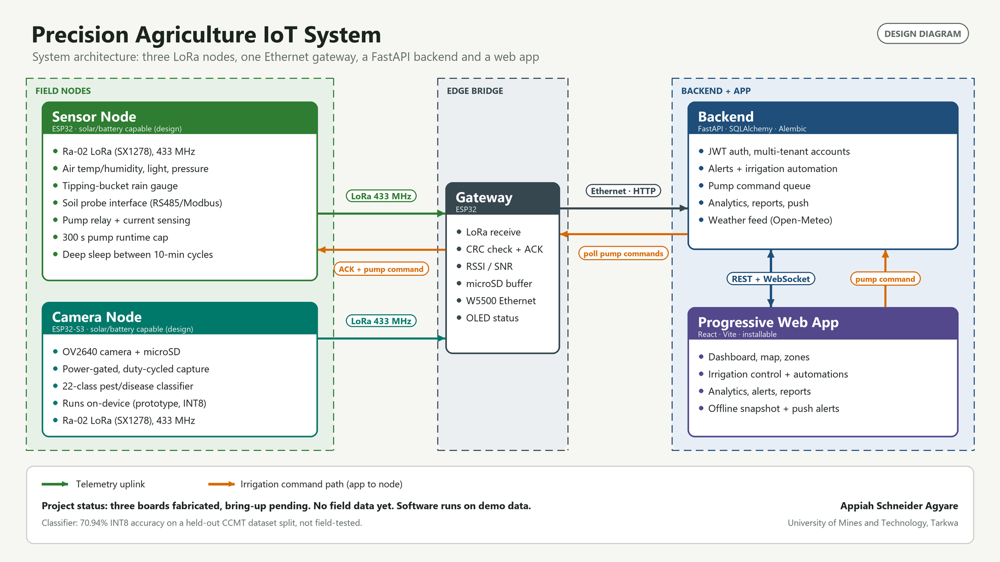

# Precision Agriculture IoT Platform (portfolio)

**Appiah Schneider Agyare** · Cybersecurity student · IoT, embedded systems, networking

A low-power, long-range precision-agriculture system built from three custom PCBs, ESP32 firmware, a FastAPI backend and a React web app. This repository is the public write-up: diagrams, design renders, results and lessons learned. The source code, PCB manufacturing files and bills of materials are kept in private repositories.

## Where it stands

Three custom PCBs (Sensor Node, Gateway, Camera Node) are fabricated and assembled. **Hardware bring-up and field testing have not happened yet.** The software runs on demo data. Everything below is labeled as designed, implemented, tested or not done. Nothing here claims the boards work in the field.

## What is in this repository

| | |
|---|---|
| [`docs/CASE_STUDY.md`](docs/CASE_STUDY.md) ([PDF](docs/PrecisionAg_Case_Study.pdf)) | Problem, design, what was built, honest status, next steps |
| [`docs/ENGINEERING_CHALLENGES.md`](docs/ENGINEERING_CHALLENGES.md) | Eleven real problems, how each was found, fixed and verified |
| [`images/`](images/) | Architecture and sequence diagrams, PCB renders and layout views, result charts |

## Highlights

- **Footprints that pass design-rule checks but do not fit the real part.** [LoRa module rows](images/lora_footprint_before_after.png) were 2.54 mm apart instead of 25.4 mm. The checker could not see it; a pre-fabrication audit did.
- **A fix that created a short circuit.** [Fuse holder footprint](images/fuse_footprint_fix.png): comparing results item by item, not by count, caught it.
- **A design trade-off, stated plainly.** The on-device classifier reaches [70.94% (INT8) on 3,768 held-out images](images/classifier_accuracy_tradeoff.png). It has not seen a single real field image and is not a diagnostic tool.
- **Reviewing my own system like an attacker.** Two real vulnerabilities in the deployed backend, [fixed and re-verified the same day](images/security_review_before_after.png), with the open items listed.
- **How a sleeping node gets a pump command.** [The ACK carries the command](images/lora_ack_command_path.png); the trade-off and a known limitation are on the diagram.
- **A bring-up plan written before powering anything.** [The checklist](images/bringup_plan_checklist.png).

## Still open

The LoRa link has a CRC but no encryption or authentication. There is no firmware signing. The Gateway's HTTPS path is compile-verified but has not run on hardware. The soil probe register map is a placeholder until the datasheet is checked. No LoRa range, battery life or sensor accuracy has been measured.

## Notes on the images

Renders and layout views are drawn from the design files, not photographs. Demo data only.

## Dataset

Mensah, P. K. et al., "Dataset for Crop Pest and Disease Detection", Mendeley Data, DOI 10.17632/bwh3zbpkpv.1 (CC BY 4.0).

## Rights

Copyright Appiah Schneider Agyare. All rights reserved unless a licence is added to this repository.
